# RVM.MenuNaMao - Manual do Usuario

> Cardapio Digital com QR Code — Guia Completo de Funcionalidades
>
> Gerado em 26/04/2026 | RVM Tech

---

## Visao Geral

O **RVM.MenuNaMao** e um sistema de cardapio digital com QR Code para restaurantes.
O cliente escaneia o QR Code da mesa, navega pelo cardapio, monta o pedido e envia diretamente
para a cozinha — sem app instalado, sem garcom intermediario.

**Recursos principais:**
- **Painel Admin Blazor** — gestao completa de restaurantes, cardapio, pedidos e estoque
- **Cardapio Digital React** — interface publica otimizada para celular via QR Code
- **Pedidos em tempo real** — do cliente direto para a cozinha, sem intermediarios
- **QR Codes por mesa** — cada mesa tem seu proprio QR Code com identificacao automatica
- **Multi-restaurante** — gerencie varios restaurantes na mesma plataforma
- **Controle de estoque** — integrado ao cardapio para baixa automatica de insumos

---

## 1. Pagina Inicial

Tela de entrada do RVM.MenuNaMao. Apresenta o sistema de gestao de cardapio digital com acesso rapido ao painel administrativo e ao cardapio publico.

**Funcionalidades:**
- Visao geral do sistema
- Acesso ao painel administrativo
- Link para cardapio digital publico
- Identidade visual do produto

| Desktop | Mobile |
|---------|--------|
|  |  |

---

## 2. Dashboard Administrativo

Painel central do administrador com metricas em tempo real: pedidos do dia, receita, itens mais vendidos e status das mesas.

**Funcionalidades:**
- Total de pedidos do dia
- Receita acumulada
- Pedidos em andamento vs concluidos
- Itens mais pedidos
- Status das mesas (livres/ocupadas)

> **Dicas:**
> - O dashboard e atualizado automaticamente a cada 30 segundos.
> - Clique nos cards de metricas para ir direto para o modulo correspondente.

| Desktop | Mobile |
|---------|--------|
| 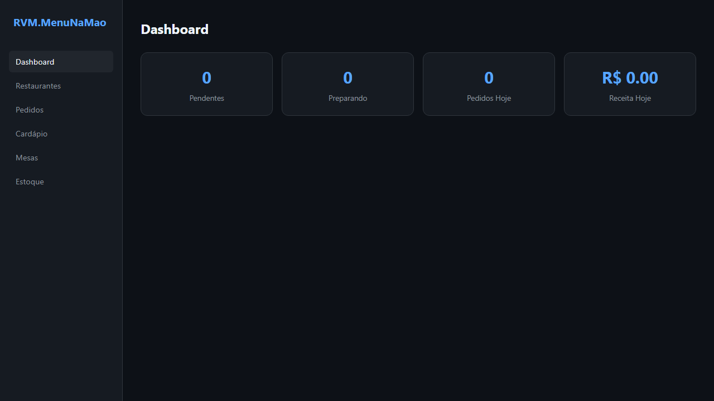 | 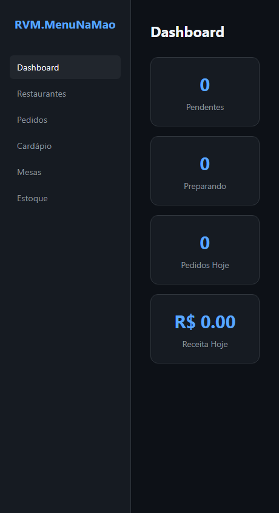 |

---

## 3. Restaurantes

Gerencie os restaurantes cadastrados no sistema. Cada restaurante tem seu proprio slug (URL amigavel), cardapio e QR Codes exclusivos.

**Funcionalidades:**
- Listagem de restaurantes cadastrados
- Cadastrar novo restaurante com nome, slug e descricao
- Editar informacoes do restaurante
- Ativar/desativar restaurante
- Copiar URL do cardapio digital
- Gerar QR Code para impressao

> **Dicas:**
> - O slug define a URL do cardapio: /menu/{slug}. Escolha um nome curto e sem espacos.
> - Restaurantes inativos nao aparecem no cardapio publico.

| Desktop | Mobile |
|---------|--------|
| 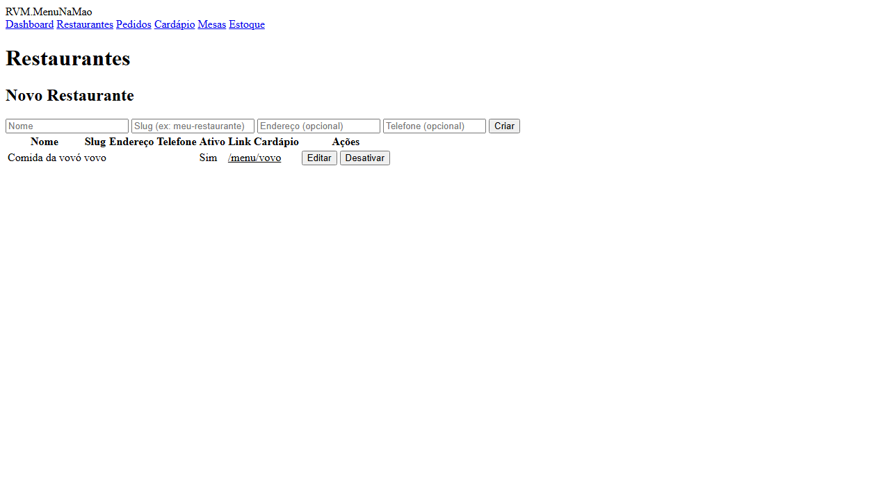 | 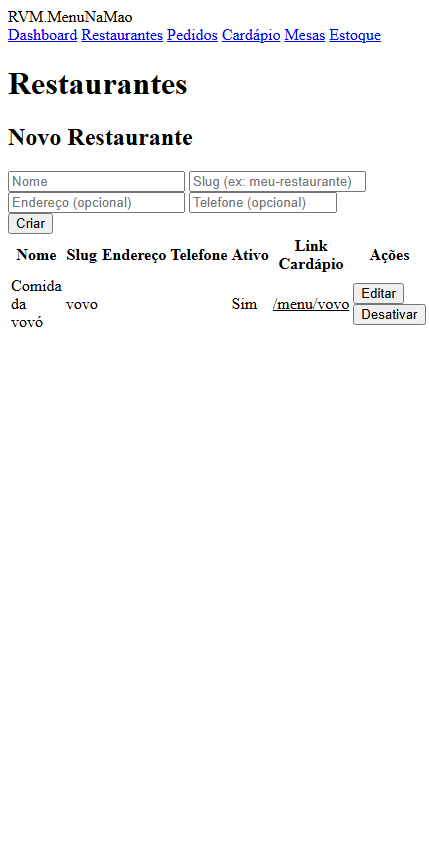 |

---

## 4. Gestao do Cardapio

Organize o cardapio do restaurante em categorias e itens. Defina precos, descricoes, fotos e disponibilidade de cada prato.

**Funcionalidades:**
- Criacao e edicao de categorias (Entradas, Pratos, Bebidas, Sobremesas)
- Adicionar itens com nome, descricao, preco e foto
- Ativar/desativar itens sem exclui-los
- Reordenar categorias e itens por arrastar e soltar
- Definir disponibilidade por horario

> **Dicas:**
> - Itens sem foto aparecem com imagem padrao no cardapio digital.
> - Desativar um item o remove temporariamente do cardapio sem perder o cadastro.

| Desktop | Mobile |
|---------|--------|
| 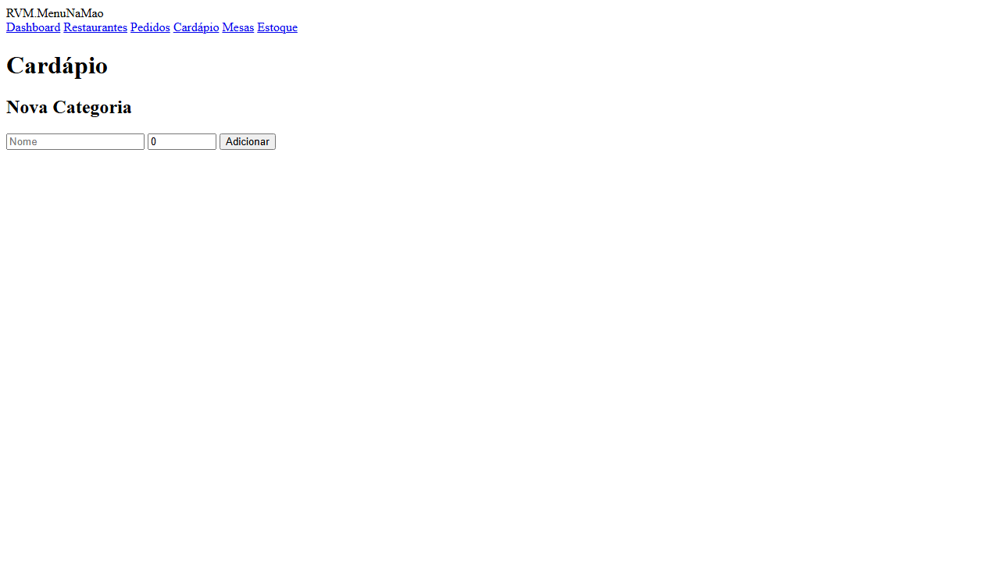 | 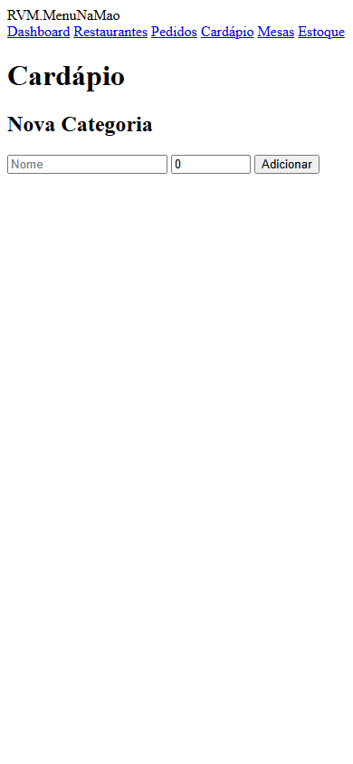 |

---

## 5. Pedidos

Acompanhe todos os pedidos em tempo real. Visualize o status de cada pedido, os itens solicitados, a mesa e o valor total.

**Funcionalidades:**
- Listagem de pedidos com status (pendente, em preparo, pronto, entregue)
- Detalhes de cada pedido: itens, quantidades, observacoes
- Atualizar status do pedido
- Filtrar por status, mesa ou periodo
- Total do pedido e metodo de pagamento

> **Dicas:**
> - Pedidos novos aparecem no topo com destaque visual.
> - Use os filtros para encontrar pedidos de uma mesa especifica.

| Desktop | Mobile |
|---------|--------|
| 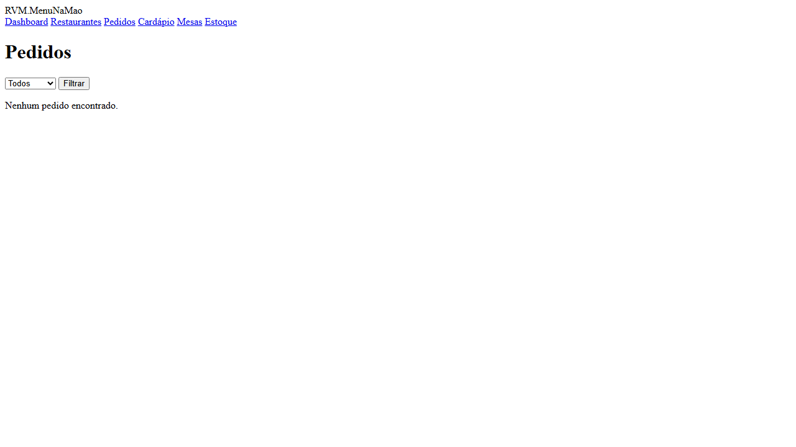 | 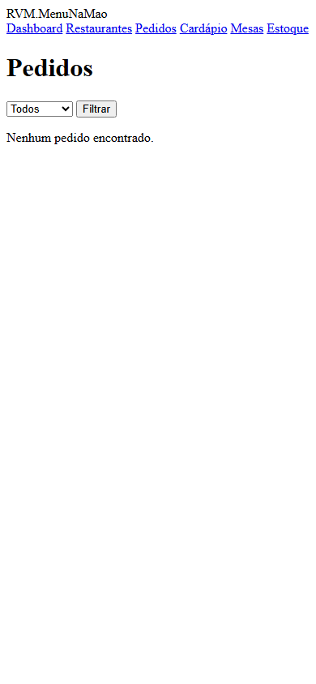 |

---

## 6. Mesas e QR Codes

Gerencie as mesas do restaurante e seus QR Codes. Cada mesa tem um QR Code unico que direciona o cliente para o cardapio digital ja identificado.

**Funcionalidades:**
- Cadastro de mesas por numero/identificador
- Geracao e download de QR Code por mesa
- Status da mesa: livre, ocupada, reservada
- Historico de pedidos por mesa
- Imprimir QR Codes em lote

> **Dicas:**
> - Imprima os QR Codes e plastifique para uso nas mesas.
> - O QR Code ja inclui o identificador da mesa — o cliente nao precisa digitar nada.

| Desktop | Mobile |
|---------|--------|
| 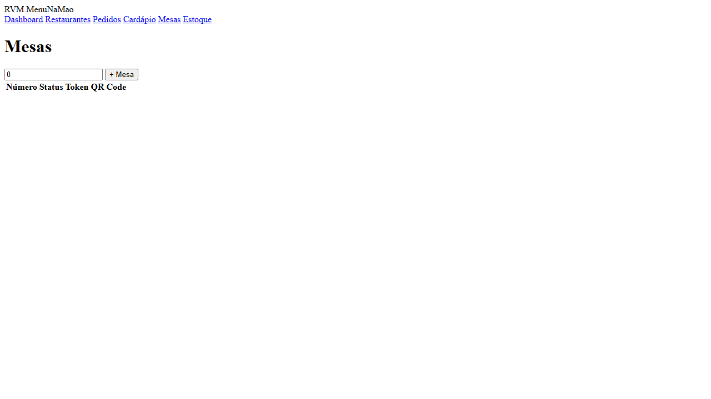 | 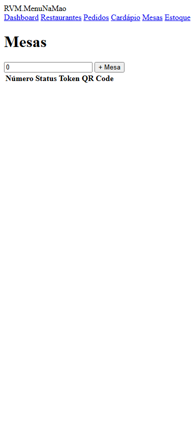 |

---

## 7. Controle de Estoque

Monitore o estoque dos ingredientes e insumos. Receba alertas quando o estoque estiver baixo e registre entradas e saidas.

**Funcionalidades:**
- Listagem de itens em estoque com quantidade atual
- Registrar entrada de insumos (compra/reposicao)
- Registrar saida manual (descarte, consumo)
- Alertas de estoque minimo
- Historico de movimentacoes

> **Dicas:**
> - Configure o nivel minimo de cada insumo para receber alertas antes de acabar.
> - Conecte itens do cardapio aos insumos para desconto automatico no estoque ao receber pedidos.

| Desktop | Mobile |
|---------|--------|
| 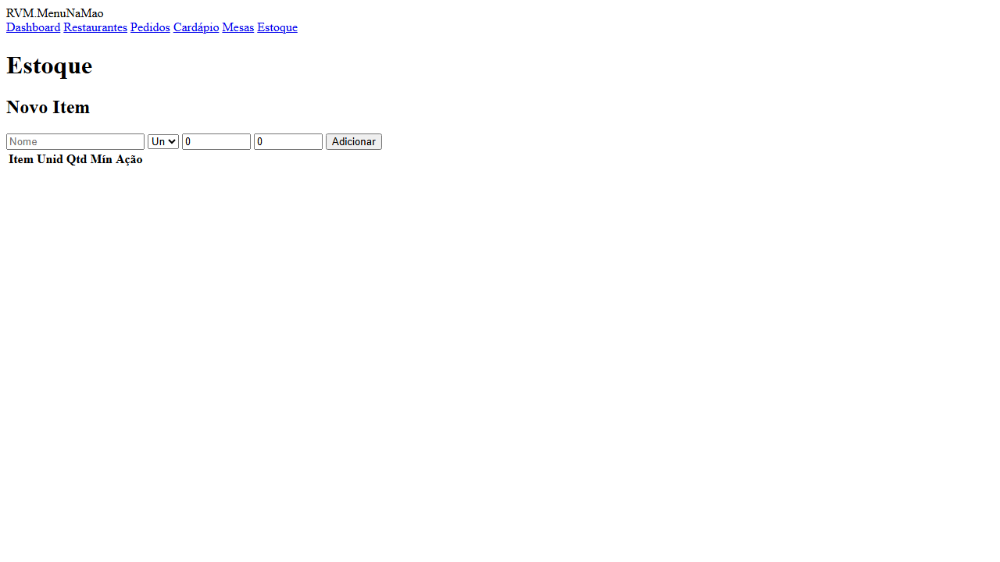 | 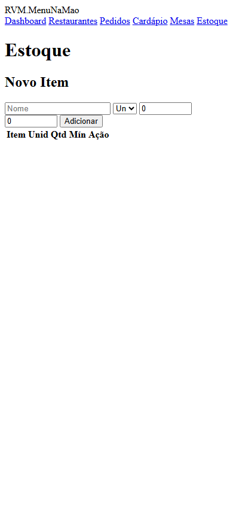 |

---

## 8. Cardapio Digital (Cliente)

Interface publica que o cliente acessa pelo QR Code da mesa. Exibe todos os itens do cardapio com fotos, descricoes e precos. O cliente navega pelas categorias e adiciona itens ao carrinho.

**Funcionalidades:**
- Navegacao por categorias (Entradas, Pratos, Bebidas, Sobremesas)
- Foto, nome, descricao e preco de cada item
- Botao "Adicionar ao carrinho" com seletor de quantidade
- Busca por nome de item
- Indicador de itens no carrinho
- Totalmente responsivo para celular

> **Dicas:**
> - Toque em um item para ver a descricao completa e opcoes de personalizacao.
> - O carrinho fica salvo mesmo se o cliente sair e voltar para o cardapio.

| Desktop | Mobile |
|---------|--------|
| 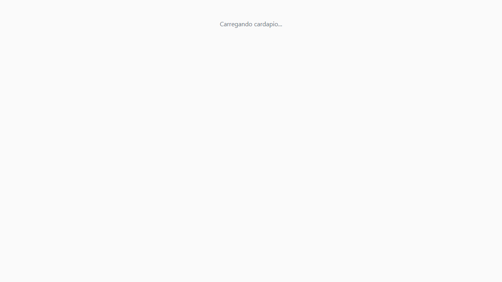 | 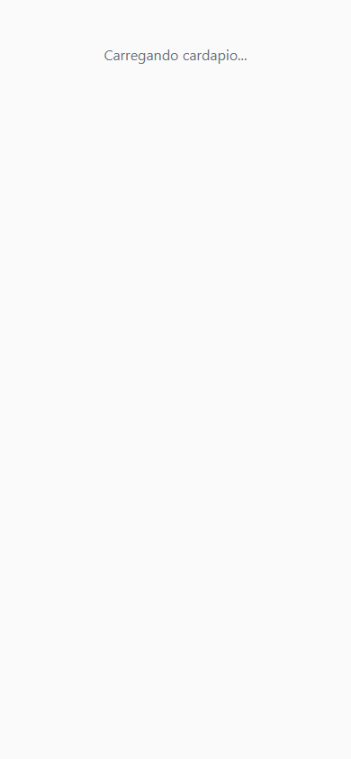 |

---

## 9. Carrinho de Compras

Resumo dos itens selecionados pelo cliente. Permite revisar quantidades, remover itens e adicionar observacoes antes de finalizar o pedido.

**Funcionalidades:**
- Lista de itens com quantidades e subtotais
- Alterar quantidade ou remover item
- Campo de observacoes por item
- Total do pedido calculado automaticamente
- Botao para continuar comprando
- Botao para ir ao checkout

| Desktop | Mobile |
|---------|--------|
| 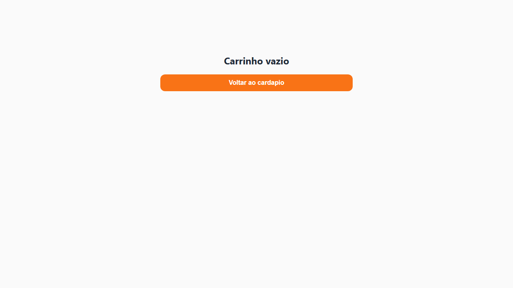 | 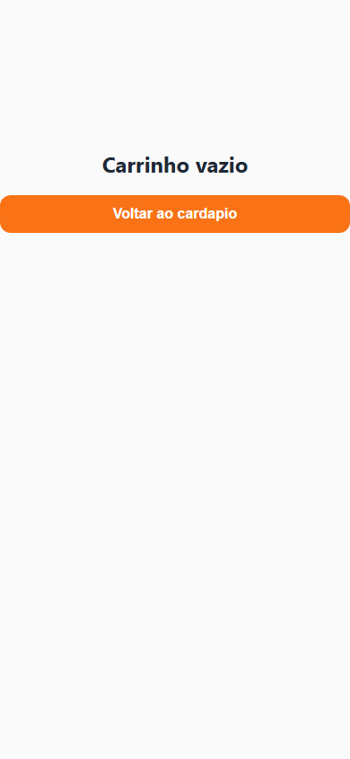 |

---

## 10. Checkout

Tela de confirmacao do pedido. O cliente informa seu nome, escolhe o metodo de pagamento e envia o pedido para a cozinha.

**Funcionalidades:**
- Campo para nome do cliente
- Selecao de metodo de pagamento (dinheiro, cartao, Pix)
- Resumo final do pedido com valores
- Botao "Enviar Pedido" para confirmar
- Confirmacao visual apos envio

> **Dicas:**
> - Apos confirmar, o pedido aparece imediatamente no painel do admin.
> - O cliente recebe uma tela de acompanhamento com o status do pedido.

| Desktop | Mobile |
|---------|--------|
| 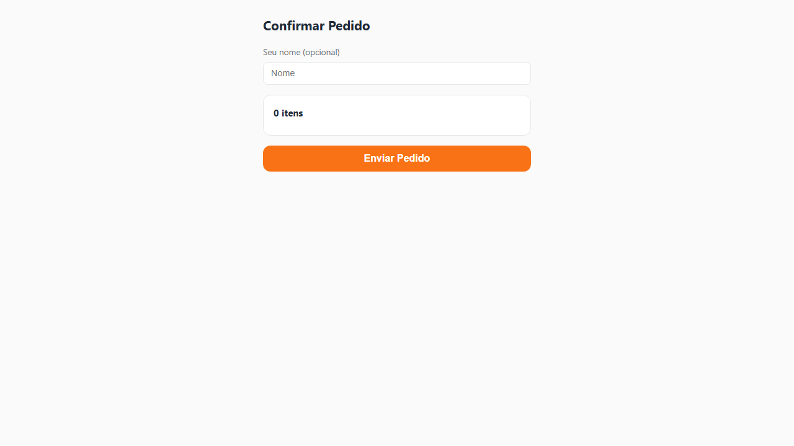 | 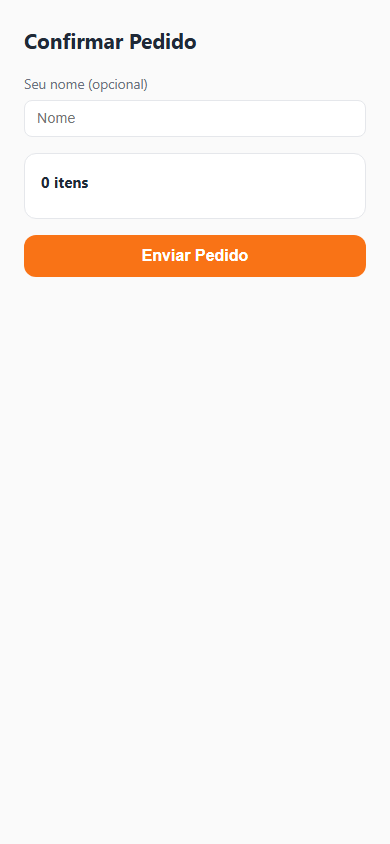 |

---

## 11. Status do Pedido

Apos confirmar o pedido, o cliente acompanha o status em tempo real: pendente, em preparo, pronto para retirar.

**Funcionalidades:**
- Status atual do pedido com indicador visual
- Lista dos itens do pedido
- Estimativa de tempo (quando disponivel)
- Notificacao quando o pedido estiver pronto

| Desktop | Mobile |
|---------|--------|
| 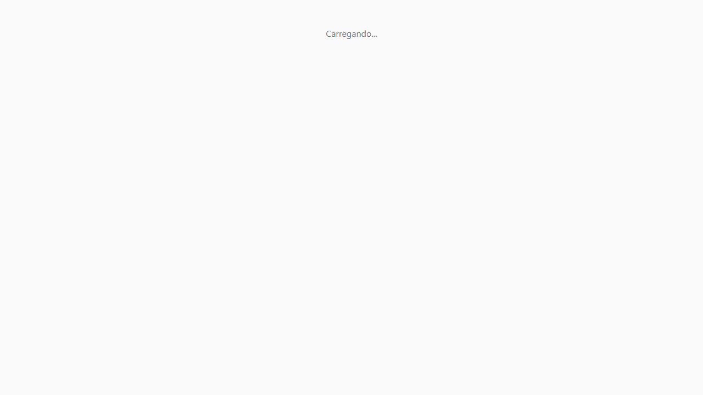 | 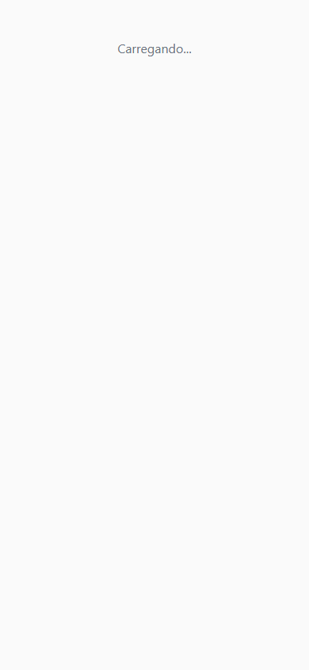 |

---

## Informacoes Tecnicas

| Item | Detalhe |
|------|---------|
| **Backend** | ASP.NET Core + Blazor Server |
| **Frontend** | React + React Router |
| **Banco de dados** | PostgreSQL 16 + EF Core |
| **QR Code** | Gerado server-side, download PNG/SVG |
| **Tempo real** | SignalR para atualizacao de pedidos |
| **Deploy** | Docker Compose + Nginx |

---

*Documento gerado automaticamente com Playwright + TypeScript — RVM Tech*
